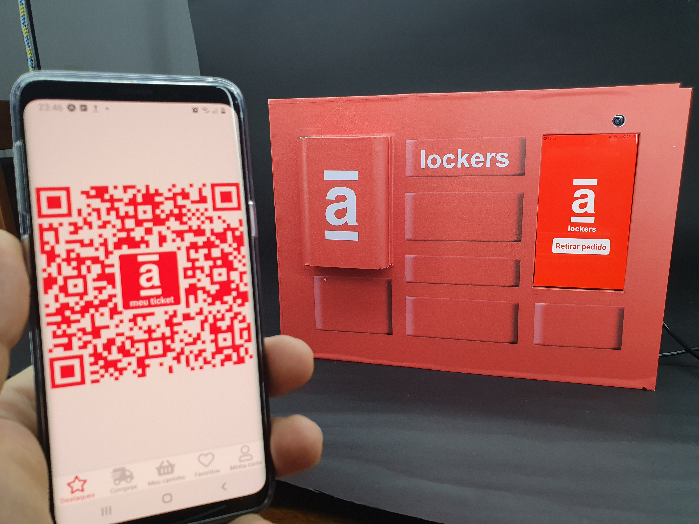
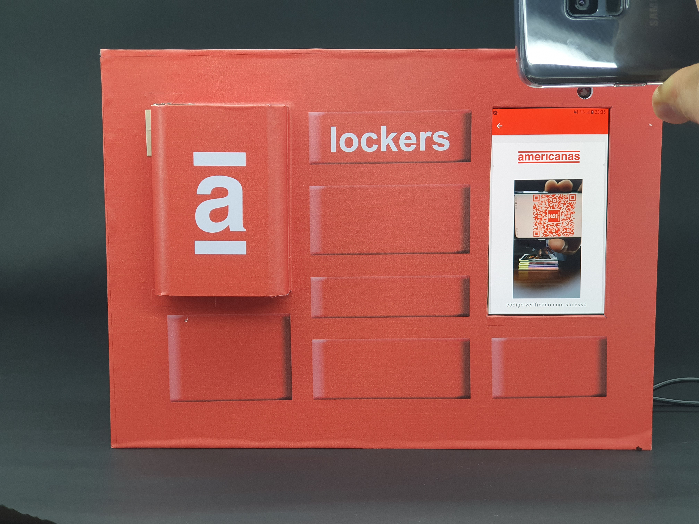
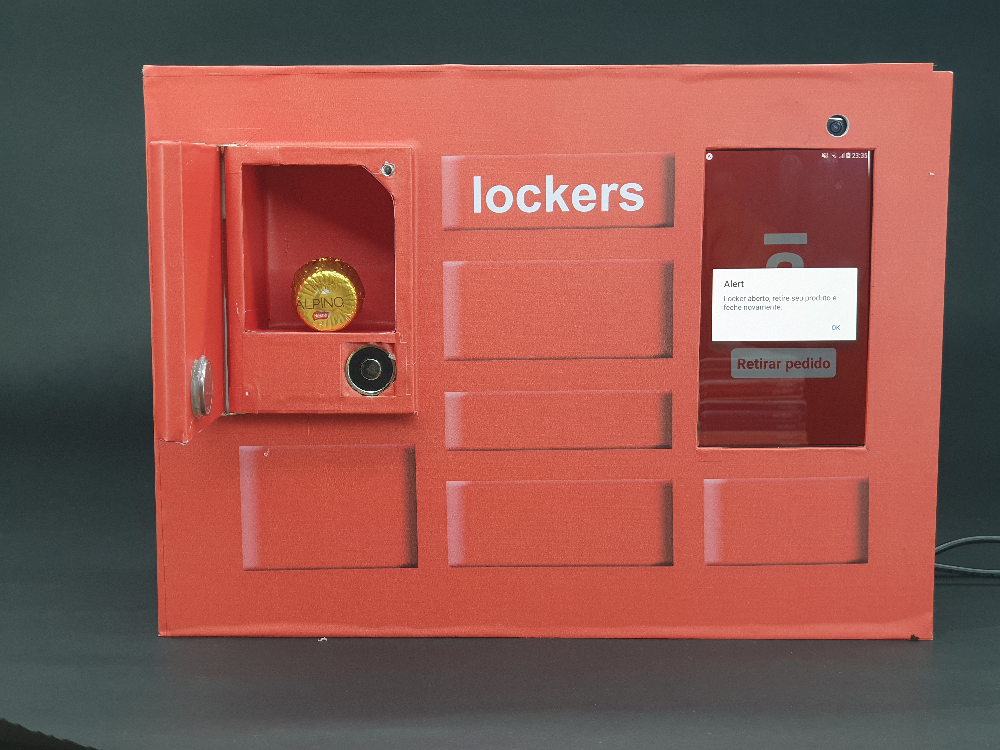

<h1>
  Megahack 2.0 - Americanas Meu Ticket/Lockers
</h1>

  

<small>
 
<a href="https://bit.ly/2YBvfay">Funcionamento</a> 
<a href="https://bit.ly/2z8PfqA">App Lockers</a> 
<a href="https://bit.ly/2SuELbR">App Tickets</a> 
<a href="https://bit.ly/3b0bRqv">Figma</a> 
<a href="https://bit.ly/35pe8u6">GitHub</a> 
<a href="https://bit.ly/3dg2Drl">Kanban</a> 
<a href="https://bit.ly/2WmvQKz">Roteiro Pitch</a> 
<a href="https://bit.ly/2YqWjt7">Slides Pitch</a> 
<a href="https://bit.ly/3bV5Psl">Slides</a> 
</small>

## Features

This back-end features the latest tools and practices in web development!

- 🐋 **React** — A JavaScript library for building user interfaces
- ♻️ **React Native** — A framework for building native apps using React
- 💹 **Express** — JavaScript back-end Framework

I've used other libraries too, **sentry** for errors; **bcrypt** for authentication and so on.

## Getting started

First you need to have `node`, `yarn` and `expo` installed on your machine.
Then, you can clone this repository and run the following commands:

1. `git clone https://github.com/robertveloso/americanas-meu-ticket.git`

2. `cd americanas-meu-ticket`;

3. replace the host in mobile/../src/config/reactotron.js

4. in backend and mobile `yarn` and `yarn start`

> ps.: don't forget to create the `.env` (please duplicate `.env.example`).

## :memo: License

This project is licensed under the MIT license. See the file [LICENSE](LICENSE.md) to obtain more details.

## Problem

> "A experiência de compra em nossas lojas físicas ainda é muito diferente da oferecida por nosso aplicativo. Além das lojas físicas e do sortimento tradicional de e-commerce, contamos agora com o conceito da compra de conveniência, realizada na vizinhança e para entrega rápida."

## Challenge

> "Pense em um produto ou uma funcionalidade que permita o usuário ter uma experiência mais fluida entre os canais físico e digital ao realizar uma compra na loja física ou pelo aplicativo. Leve em consideração uma ou mais das seguintes perguntas:
>
> - Como estimular o cliente a utilizar o aplicativo, para dar apoio a sua compra na loja física?
> - Como estimular o cliente a usar o aplicativo para fazer as compras que seriam realizadas na loja física, porém fazendo-a sem sair de casa?
> - Como seria a transição do mundo físico para o digital, e vice-versa?
> - O que temos de melhor do mundo físico para estar no digital, e vice-versa?"

---

Made with love ♥ by Robert Veloso :wave:.
[Get in touch with me, Developer - UI/UX](https://www.linkedin.com/in/robertveloso),
[or discord me!](https://discordapp.com/channels/@me/robertveloso#1547)

Our hackathon team: 

- [@Linkedin do João Paulo, Business - Developer](https://www.linkedin.com/in/jpterrazam)
- [@Linkedin do Rodrigo, Developer](https://www.linkedin.com/in/rodrigo-pauletti-07239979)
- [@Linkedin da Gabriela, Marketing](https://www.linkedin.com/in/marilia-gabriela-soares-mgsoares)
- [@Linkedin do Daniel, Marketing](https://www.linkedin.com/in/daniel-m-araujo)
